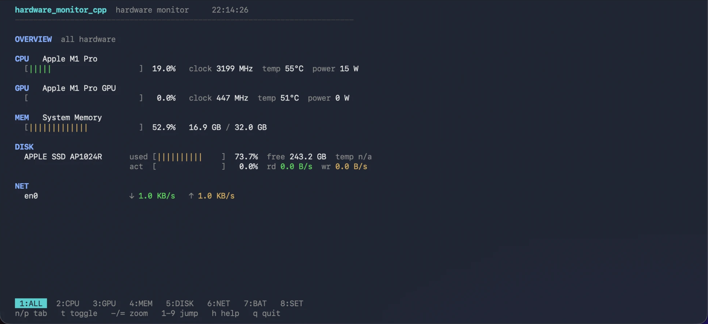
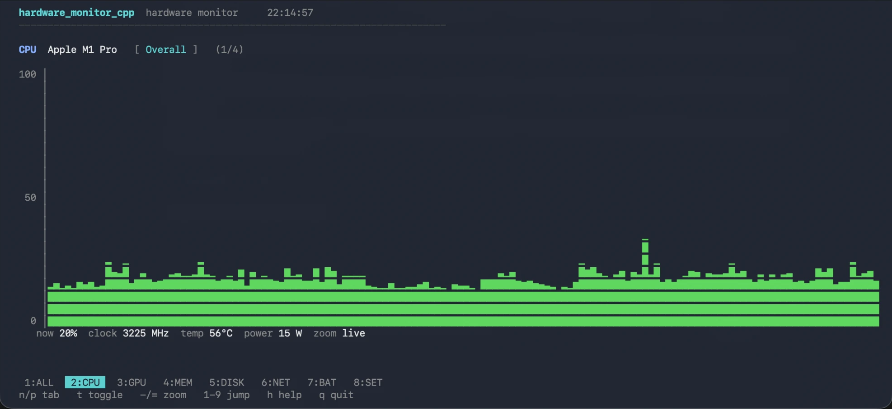
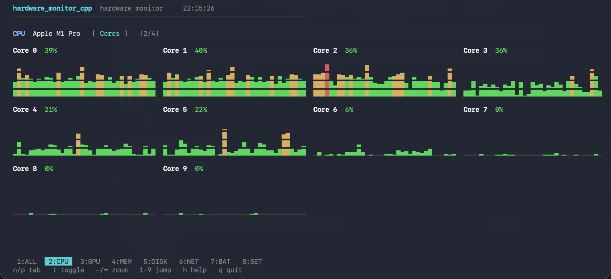
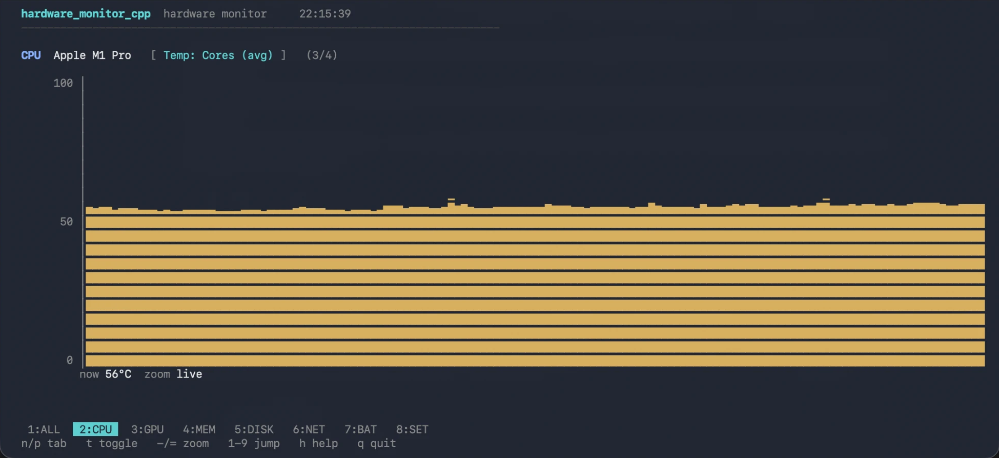
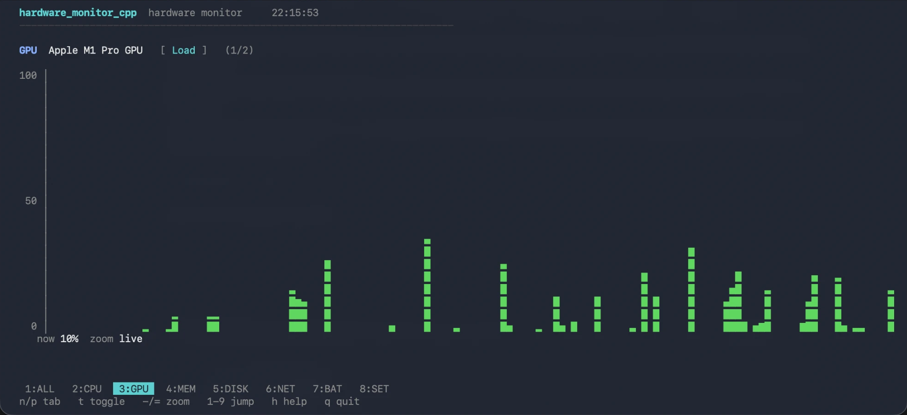
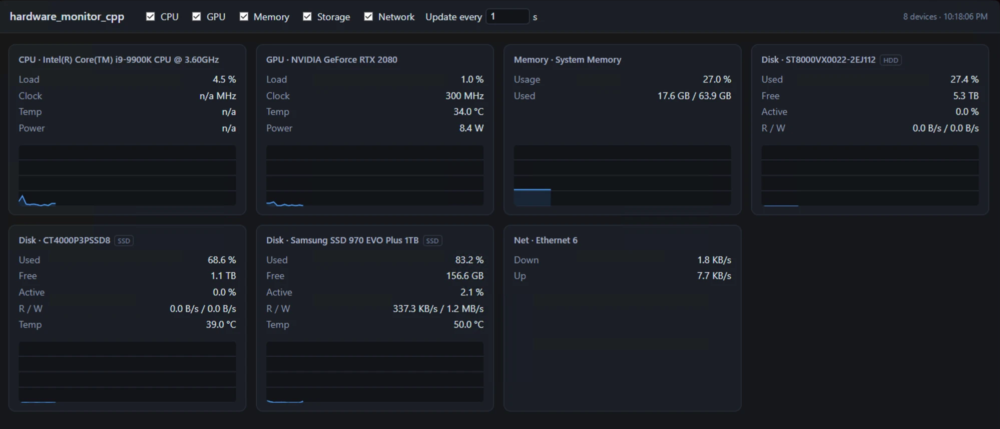

# hardware_monitor_cpp

<p align="center">
  
  
  
  
  
</p>

A cross-platform hardware-telemetry library with a small, data-oriented core. It exposes the
machine's sensors as a flat, queryable stream of **readings** rather than an object tree.

<p align="center">
  
</p>

> [!IMPORTANT]
> **No component tree.** Most monitoring libraries hand you `Machine → CPU → Core → Sensor`
> and make you walk it. `poll()` returns a flat `Reading` array instead, so "every temperature
> on this machine" is one filter call, not a recursive descent - and the whole snapshot
> serializes to JSON without a custom visitor.

## Why this library?

- **No third-party dependencies.** The core needs only the C++ standard library and the OS's own
  APIs (IOKit/CoreFoundation, Win32, `/proc` and `/sys`). NVIDIA's NVML and PawnIO are loaded
  dynamically *if present* - never linked, never required to build.
- **No elevated privileges on the common path.** Load, clock, memory, network, storage, GPU and
  battery all read as an ordinary user. Only CPU package temperature/power (ring-0 MSR) and some
  macOS SMC sensors need administrator/root.
- **Independent implementation.** Only non-copyrightable facts are reused (OS API signatures,
  IOCTL codes, MSR/SMC keys, JEDEC SPD layouts, NVMe offsets, PCI IDs). See [`NOTICE.md`](NOTICE.md).

## Model

```
Monitor              owns Sources, enumerates devices, produces Snapshots
 └─ Source           one data origin (a subsystem on one OS); appends Readings each poll
Snapshot             immutable { devices[], readings[] }; filter by device or quantity
Reading              { device, quantity, unit, channel, value }   ← the atomic unit
DeviceInfo / DeviceId  stable (kind, ordinal) identity + metadata
```

```cpp
#include "hardware_monitor_cpp/hardware_monitor_cpp.hpp"
#include <cstdio>
using namespace hardware_monitor_cpp;

Monitor m;
m.addPlatformSources();
m.open();
m.poll();                          // prime delta metrics (load, throughput)
Snapshot s = m.poll();             // sample

for (const Reading& r : s.forQuantity(Quantity::Temperature))
{
    const DeviceInfo* d = s.device(r.device);  // DeviceId is a handle; names live here
    std::printf("%-18s %-12s %6.1f %s\n", d->name.c_str(), r.channel.c_str(), r.value,
                unitSymbol(r.unit));
}
```

```
Apple M1 Pro       Cores (avg)    50.4 °C
Apple M1 Pro       Cores (max)    61.0 °C
Apple M1 Pro GPU   Die            46.9 °C
Battery            Temperature    30.8 °C
```

Swap `forQuantity` for `forDevice(id)` to slice the other way. For a complete report - every
device, attribute and reading, in ~20 lines - see
[`examples/hardware_monitor_cpp_dump.cpp`](examples/hardware_monitor_cpp_dump.cpp); it never
branches on device type, which is the point of the flat model.

## Status

| | 🍏 **macOS** (Apple Silicon) | 🪟 **Windows** | 🐧 **Linux** |
| :--- | :--- | :--- | :--- |
| **CPU** | ✅ load, temp, package/ANE power, E/P-cluster clock, fans | ✅ load, clock, name - Intel **and** AMD; package/Tctl temp + RAPL power via ring-0 MSR (PawnIO) | ✅ load (`/proc/stat`), clock (cpufreq), temp (hwmon), package power (RAPL) |
| **GPU** | ✅ util, memory, temp, power, clock | ✅ NVIDIA (NVML), Intel iGPU (DXGI+PDH); AMD (ADL) + Intel Arc (IGCL) <sup>1</sup> | ✅ NVIDIA (NVML); AMD/Intel via `/sys/class/drm` + hwmon |
| **RAM** | ✅ used, available, swap | ✅ used, available, swap + commit charge | ✅ used, available, swap (`/proc/meminfo`) |
| **Storage** | ✅ disks, size, free | ✅ disks, size, free, NVMe/ATA temp | ✅ disks, size, free, drive temp (`/sys/block`) |
| **Network** | ✅ per-interface bytes + throughput | ✅ per-interface bytes + throughput | ✅ per-interface bytes + throughput (`/sys/class/net`) |
| **Battery** | ✅ charge, capacities, health, voltage, current/power, temp, cycles, time-to-full/empty | ✅ charge, capacities, health, voltage, current/power, temp, runtime - **+ UPS** | ✅ charge, capacities, voltage, current/power, temp, cycles |

**Verified on real hardware**

- **macOS** - Apple M1 Pro.
- **Windows** - CPU temp/power on **i9-9900K**, **i7-8550U** and **Ryzen 7 3700X**; NVIDIA
  **RTX 2080 / 3060 Ti**; Intel integrated **UHD 620**; laptop battery + desktop UPS.
- **Linux** - WSL2 (CPU load, memory, network, NVIDIA). The hwmon / RAPL / storage / battery
  paths target bare-metal Linux.

<sup>1</sup> AMD Radeon (ADL) and Intel Arc (IGCL) discrete-GPU telemetry is implemented from SDK
facts but **not yet verified on Radeon/Arc hardware**.

## Applications

Two ready-to-ship monitors live in their own top-level folders, each with its own CMake:

- **`console/`** - a live terminal monitor (`hardware_monitor_console`) showing CPU usage/clock/temperature,
  GPU usage/clock/temperature, SSD temperatures (HDDs are skipped), and network throughput,
  refreshing every second (or `hardware_monitor_console <seconds>`).
  ```sh
  cd console && cmake -S . -B build -DCMAKE_BUILD_TYPE=Release && cmake --build build
  ./build/bin/hardware_monitor_console 2
  ```

  Tabs cycle with `n`/`p`, views with `t`, and `-`/`=` zoom the time axis from live out to
  minutes per column:

  | Overall load | Per-core grid |
  | :--- | :--- |
  |  |  |
  | **Thermals** | **GPU** |
  |  |  |
- **`webserver/`** - a Python dashboard. CMake builds a small C-ABI shared library wrapping
  hardware_monitor_cpp and assembles `build/dist/` (the library + `hardware_monitor_server.py` + `web/`). The server
  uses only the standard-library `http.server` and loads the library via `ctypes`; the page draws
  load graphs and offers toggles for which sections to show and the update interval.
  ```sh
  cd webserver && cmake -S . -B build -DCMAKE_BUILD_TYPE=Release && cmake --build build
  cd build/dist && python hardware_monitor_server.py        # http://127.0.0.1:8000
  ```

  <p align="center">
    
  </p>

Both run without privileges for load/clock/memory/network/storage/GPU/battery; CPU temperature and
package power additionally need administrator/root (and PawnIO on Windows).

> **Windows TUI + `sudo`:** the console monitor draws its graphs with Unicode block glyphs, which
> need a TrueType console font (Cascadia Mono, Consolas). If you elevate with `sudo` and it is set to
> **"In a new window"**, that window uses the raster default font and the sparklines show as boxes.
> Set `sudo` to **Inline** (Settings → System → For developers → Sudo → *Inline*) so it runs in your
> current terminal - or pick a TrueType font via the console window's Properties → Font.

## Building

```sh
git clone --recurse-submodules <repo>
```

The repo-root Python scripts are the easiest path - they configure and build with CMake, then
print where the artifacts landed. **On Windows they also download and install the signed PawnIO
module matching your CPU**, so CPU temperature and package power work with no extra steps:

```sh
python build_lib.py        # core static library + hardware_monitor_cpp_dump example
python build_console.py    # console/build/bin/hardware_monitor_console
python build_server.py     # webserver/build/dist/ (library + server + web assets)
```

They need only Python 3 and CMake - no packages to install.

Plain CMake works too, if you would rather drive the build yourself:

```sh
cmake -S . -B build -DCMAKE_BUILD_TYPE=Release
cmake --build build
./build/hardware_monitor_cpp_dump
```

Some macOS sensors (SMC temperatures, fans) require running as root.

## Third-party resources

Ring-0 access on Windows (CPU temperature + RAPL power) uses the **PawnIO** signed kernel driver
via its official `PawnIOLib.dll`, loaded dynamically. The Pawn module *sources* are referenced as
a git submodule under `third_party/pawnio-modules` (`namazso/PawnIO.Modules`, LGPL-2.1, pinned to
`0.1.6`). The **signed module binary** (`IntelMSR.bin` on Intel, `AMDFamily17.bin` on AMD) is a
release artifact and is **not** bundled - place it in a `modules/` folder next to the executable or
set `HARDWARE_MONITOR_CPP_PAWNIO_DIR`. On Windows you can automate this with the helper script, which detects your
CPU vendor, downloads the pinned module, and drops it next to each built executable:

```powershell
powershell -ExecutionPolicy Bypass -File scripts\windows\setup-pawnio.ps1
```

These reads require **administrator** privileges and PawnIO (the driver itself, from
<https://pawnio.eu>) to be installed; without them the CPU source still reports load and clock.

## License

hardware_monitor_cpp is **dual-licensed**:

- **Free for noncommercial use** under the **PolyForm Noncommercial License 1.0.0**
  ([`LICENSE.md`](LICENSE.md)) - personal, research, education, evaluation, nonprofit.
- **Commercial use requires a paid commercial license** - see [`LICENSING.md`](LICENSING.md).

Contributions are accepted under the [`CLA.md`](CLA.md). Third-party components and the project's
independent-implementation status are documented in [`NOTICE.md`](NOTICE.md).
